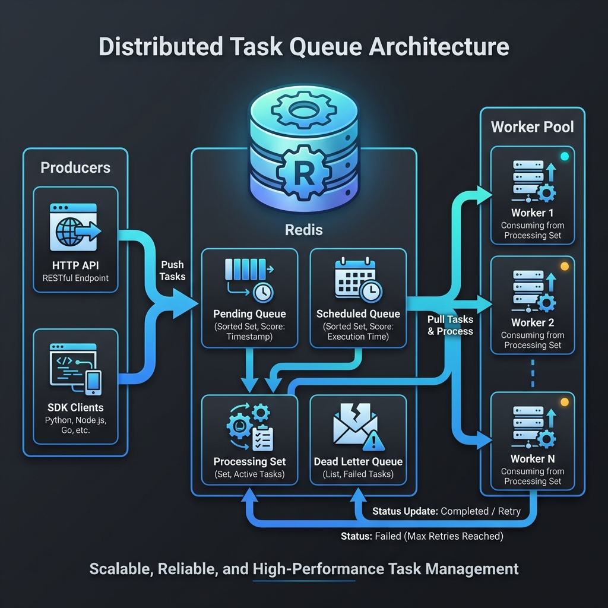
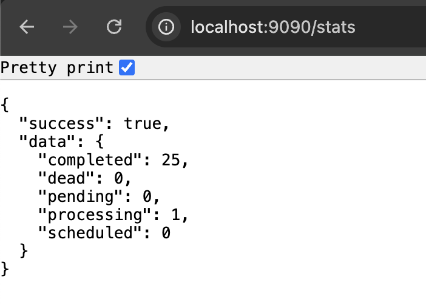
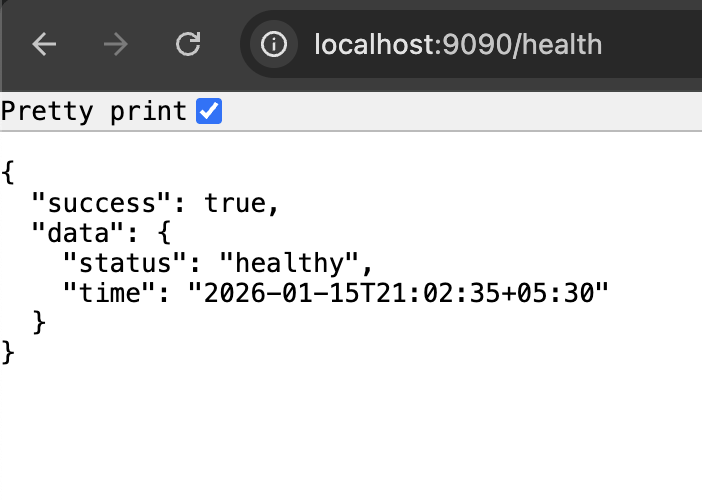

# Distributed Task Queue

A high-performance, Redis-backed distributed task queue written in Go. Features include delayed task scheduling, automatic retries with exponential backoff, dead-letter queues, priority-based execution, and exactly-once processing guarantees.

## Features

- **Redis-backed Persistence** - Reliable task storage with data durability
- **Delayed Tasks** - Schedule tasks to run at a specific time or after a delay
- **Automatic Retries** - Exponential backoff with configurable retry limits
- **Dead-Letter Queue** - Failed tasks are preserved for debugging and manual retry
- **Priority Queues** - Tasks are processed based on priority (Critical > High > Normal > Low)
- **Worker Pool** - Configurable concurrency with graceful shutdown
- **Exactly-Once Semantics** - Idempotency keys prevent duplicate processing
- **📊 Monitoring** - Built-in stats and health endpoints
- **🐳 Docker Ready** - Comes with Docker and docker-compose support

## Architecture



The distributed task queue follows a producer-consumer pattern with Redis as the central message broker:

- **Producers** - HTTP API or SDK clients that enqueue tasks
- **Redis** - Central storage with sorted sets for priority queues, scheduled tasks, and dead-letter queues
- **Workers** - Pool of concurrent workers that process tasks with automatic retries

## Screenshots

### Queue Statistics API


### Health Check API


## Quick Start


### Installation

```bash
git clone https://github.com/ritikchawla/distributed-task-queue.git
cd distributed-task-queue
go mod download
```

### Running Locally

1. **Start Redis** (if not already running):
```bash
# Using Docker
make redis-start

# Or if you have Redis installed locally
redis-server
```

2. **Start the Worker**:
```bash
make run-worker
```

3. **Enqueue Tasks** (in another terminal):
```bash
make run-example
```

4. **Optional: Start HTTP API Server**:
```bash
make run-server
```

## Usage

### As a Library

```go
package main

import (
    "context"
    "log"
    "time"

    "github.com/ritikchawla/distributed-task-queue/pkg/queue"
    "github.com/ritikchawla/distributed-task-queue/pkg/task"
    "github.com/ritikchawla/distributed-task-queue/pkg/worker"
)

func main() {
    ctx := context.Background()

    // Create a queue client
    q, err := queue.New(queue.Config{
        RedisAddr: "localhost:6379",
        KeyPrefix: "myapp",
    })
    if err != nil {
        log.Fatal(err)
    }
    defer q.Close()

    // Enqueue a simple task
    t, err := q.Enqueue(ctx, "email.send", map[string]interface{}{
        "to":      "user@example.com",
        "subject": "Hello!",
    })
    if err != nil {
        log.Fatal(err)
    }
    log.Printf("Created task: %s", t.ID)

    // Enqueue with options
    q.Enqueue(ctx, "report.generate", map[string]interface{}{
        "type": "sales",
    },
        task.WithPriority(task.PriorityHigh),
        task.WithMaxRetries(5),
        task.WithTimeout(5*time.Minute),
    )

    // Enqueue delayed task
    q.EnqueueDelayed(ctx, "reminder.send", map[string]interface{}{
        "message": "Don't forget!",
    }, 30*time.Minute)

    // Enqueue with idempotency key (exactly-once)
    q.Enqueue(ctx, "payment.process", map[string]interface{}{
        "amount": 99.99,
    }, task.WithIdempotencyKey("order-12345"))
}
```

### Creating a Worker

```go
package main

import (
    "context"
    "log"

    "github.com/ritikchawla/distributed-task-queue/pkg/task"
    "github.com/ritikchawla/distributed-task-queue/pkg/worker"
)

func main() {
    pool, err := worker.NewPool(worker.PoolConfig{
        Concurrency: 4,
        RedisAddr:   "localhost:6379",
    })
    if err != nil {
        log.Fatal(err)
    }

    // Register task handlers
    pool.RegisterHandler("email.send", func(ctx context.Context, t *task.Task) (interface{}, error) {
        to := t.Payload["to"].(string)
        subject := t.Payload["subject"].(string)
        
        // Send email logic here...
        log.Printf("Sending email to %s: %s", to, subject)
        
        return map[string]string{"status": "sent"}, nil
    })

    // Start processing
    ctx := context.Background()
    if err := pool.Start(ctx); err != nil {
        log.Fatal(err)
    }

    // Wait for shutdown signal
    pool.WaitForSignal()
}
```

### Using the HTTP API

Start the server:
```bash
make run-server
```

**Create a task:**
```bash
curl -X POST http://localhost:8080/tasks \
  -H "Content-Type: application/json" \
  -d '{
    "type": "email.send",
    "payload": {
      "to": "user@example.com",
      "subject": "Test Email"
    },
    "priority": "high"
  }'
```

**Get task status:**
```bash
curl http://localhost:8080/tasks/{task-id}
```

**Get queue statistics:**
```bash
curl http://localhost:8080/stats
```

**Health check:**
```bash
curl http://localhost:8080/health
```

**View dead-letter queue:**
```bash
curl http://localhost:8080/dlq
```

**Requeue a dead task:**
```bash
curl -X POST http://localhost:8080/dlq/{task-id}/requeue
```

## Configuration

### Environment Variables

| Variable | Default | Description |
|----------|---------|-------------|
| `REDIS_ADDR` | `localhost:6379` | Redis server address |
| `REDIS_PASSWORD` | `` | Redis password (if required) |
| `REDIS_DB` | `0` | Redis database number |
| `WORKER_CONCURRENCY` | `4` | Number of concurrent workers |
| `POLL_INTERVAL` | `100ms` | How often workers check for new tasks |
| `KEY_PREFIX` | `dtq` | Prefix for all Redis keys |
| `DEFAULT_MAX_RETRIES` | `3` | Default max retries for tasks |
| `DEFAULT_TIMEOUT` | `30s` | Default task execution timeout |
| `HTTP_PORT` | `8080` | HTTP server port |

## Task Priorities

Tasks are processed in priority order:

| Priority | Value | Use Case |
|----------|-------|----------|
| `PriorityCritical` | 100 | Security alerts, payment failures |
| `PriorityHigh` | 10 | User-facing notifications |
| `PriorityNormal` | 5 | Regular tasks (default) |
| `PriorityLow` | 1 | Batch jobs, reports |

## Retry Behavior

Failed tasks are retried with exponential backoff:

| Retry | Delay |
|-------|-------|
| 1st | 2 seconds |
| 2nd | 4 seconds |
| 3rd | 8 seconds |
| 4th | 16 seconds |
| 5th | 32 seconds |
| ... | max 5 minutes |

After exhausting all retries, tasks are moved to the dead-letter queue.

## Docker Deployment

### Using Docker Compose

```bash
# Start all services
docker-compose up -d

# View logs
docker-compose logs -f

# Stop services
docker-compose down
```

### Building Docker Images

```bash
# Build images
docker build -t dtq-server --target server .
docker build -t dtq-worker --target worker .

# Run
docker run -e REDIS_ADDR=host.docker.internal:6379 -p 8080:8080 dtq-server
docker run -e REDIS_ADDR=host.docker.internal:6379 dtq-worker
```

## Development

### Project Structure

```
.
├── cmd/
│   ├── server/         # HTTP API server
│   ├── worker/         # Worker with example handlers
│   └── example/        # Example producer
├── pkg/
│   ├── queue/          # Queue client
│   ├── storage/        # Redis storage layer
│   ├── task/           # Task definitions
│   └── worker/         # Worker pool
├── internal/
│   └── config/         # Configuration
├── screenshots/
├── Dockerfile
├── docker-compose.yml
├── Makefile
└── README.md
```

### Running Tests

```bash
# Run all tests
make test

# Run tests with coverage
make test-coverage

# Run tests without Redis (unit tests only)
make test-short
```

### Building

```bash
# Build all binaries
make build

# Build individual components
make build-server
make build-worker
```

## Performance

Benchmarks on a MacBook Pro M3 with Redis running locally:

- **Enqueue throughput**: ~50,000 tasks/second
- **Dequeue throughput**: ~30,000 tasks/second
- **Worker processing**: Limited by handler implementation

## License

This project is licensed under the MIT License - see the [LICENSE](LICENSE) file for details.

## Acknowledgments

- Inspired by [Sidekiq](https://github.com/mperham/sidekiq), [Celery](https://github.com/celery/celery), and [Asynq](https://github.com/hibiken/asynq)
- Built with [go-redis](https://github.com/redis/go-redis)